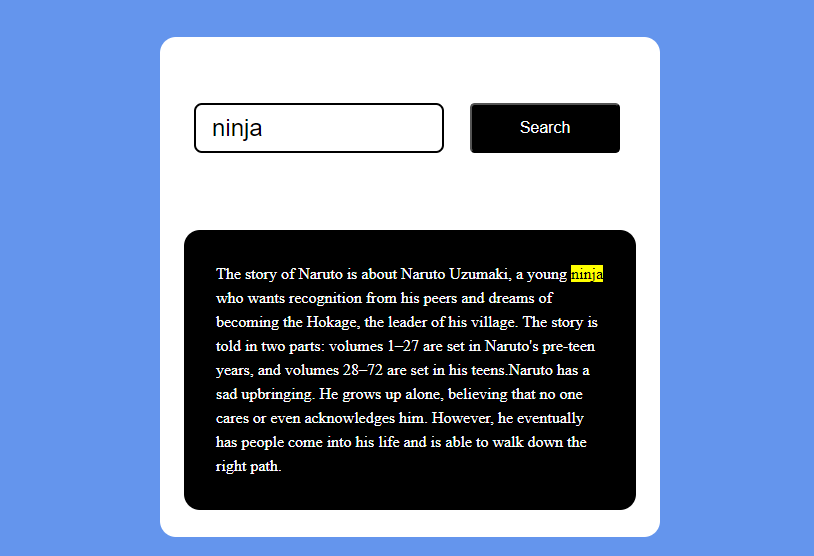

# Text-To-Highlight:
Here is the function to work with, it actually a RegExp reference Link: <a href="https://developer.mozilla.org/en-US/docs/Web/JavaScript/Guide/Regular_expressions"> Go to Link</a>


# Output:
<br><br>


```javascript
function search() {
    let textToSearch = document.getElementById("input").value;
    let paragraph = document.getElementById("para");
    textToSearch = textToSearch.replace(/[.*+?^${}()|[\]\\]/g, "\\$&");
    let pattern = new RegExp(`${textToSearch}`, "gi");
    paragraph.innerHTML = paragraph.textContent.replace(pattern, (match) => `<mark>${match}</mark>`);
}
```
let's break down the code step by step:

1. **Function Declaration:**
   ```javascript
   function search() {
   ```
   This declares a function named `search`.

2. **Getting Input Value:**
   ```javascript
   let textToSearch = document.getElementById("input").value;
   ```
   It retrieves the value of the input element with the id "input" and stores it in the variable `textToSearch`.

3. **Getting Paragraph Element:**
   ```javascript
   let paragraph = document.getElementById("para");
   ```
   It retrieves the paragraph element with the id "para" and stores it in the variable `paragraph`.

4. **Escaping Special Characters:**
   ```javascript
   textToSearch = textToSearch.replace(/[.*+?^${}()|[\]\\]/g, "\\$&");
   ```
   This line escapes special characters in the `textToSearch` using regular expression. This is necessary because if `textToSearch` contains any special characters used in regular expressions, they need to be properly escaped to avoid any unintended behavior.

5. **Creating Regular Expression Pattern:**
   ```javascript
   let pattern = new RegExp(`${textToSearch}`, "gi");
   ```
   This line creates a regular expression pattern using the value stored in `textToSearch`. The `gi` flags stand for global search (search for all occurrences) and case-insensitive search.

6. **Replacing Text with Highlighting:**
   ```javascript
   paragraph.innerHTML = paragraph.textContent.replace(pattern, (match) => `<mark>${match}</mark>`);
   ```
   This line replaces the text content of the paragraph with highlighted matches. It uses `replace()` method along with the regular expression pattern (`pattern`) to find all matches in the paragraph's text content and replace them with `<mark>` tags, effectively highlighting them.

7. **Function End:**
   ```javascript
   }
   ```
   This marks the end of the `search()` function.

